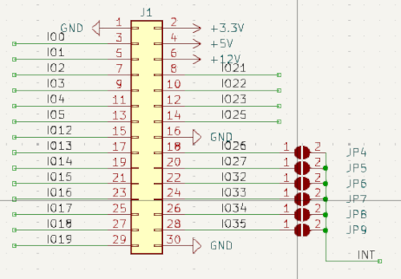

# Mercury_PCB_Inputx5_V100   

<picture></picture>

Each input is isolated from the processor's power supply.   
Additionally, each input is isolated from other inputs.   
You can read the input state via the I2C bus.   
The module is powered by 3.3V.   
I2C transmission is provided by a PCF8574.   
You can set the module address using jumpers JP1, JP2, and JP3.   
<picture><kbd></kbd></picture>   
The PCF8574 chip can trigger interrupts.   
You can specify the GPIO line to which the interrupt will be connected using jumpers JP4, JP5, JP6, JP7, JP8, and JP9.   
<picture></picture>   
<picture></picture>   

## Links:   

#### Hardware:   
1. <a href="https://github.com/krzychoooo/Mercury_PCB_Ethernet_V100" target="_blank">Mercury_PCB_Ethernet_V100</a>
2. <a href="https://github.com/krzychoooo/Mercury_PCB_NPNOUT_x8_V100" target="_blank">Mercury_PCB_NPNOUT_x8_V100</a>
3. <a href="https://github.com/krzychoooo/Mercury_PCB_Relay3x_V100" target="_blank">Mercury_PCB_Relay3x_V100</a>
4. <a href="https://github.com/krzychoooo/Mercury_PCB_UOut1-10V_V100" target="_blank">Mercury_PCB_UOut1-10V_V100</a>   
5. <a href="https://github.com/krzychoooo/Mercury_PCB_Inputx5_V100" target="_blank">Mercury_PCB_Inputx5_V100</a>   
6. <a href="https://github.com/krzychoooo/MercuryBase_4slot" target="_blank">MercuryBase_4slot</a>

#### Soft:   
1. <a href="https://github.com/krzychoooo/Mercury_Soft_UOut1-10V_V100" target="_blank">Mercury_Soft_UOut1-10V_V100</a>
2. <a href="https://github.com/krzychoooo/Mercury_Soft_RS485_V100" target="_blank">Mercury_Soft_RS485_V100</a>
3. <a href="https://github.com/krzychoooo/Mercury_Soft_Relay_x3_V100" target="_blank">Mercury_Soft_Relay_x3_V100</a>
4. <a href="https://github.com/krzychoooo/Mercury_Soft_Input5x_V1.0.0" target="_blank">Mercury_Soft_Input5x_V1.0.0</a>   